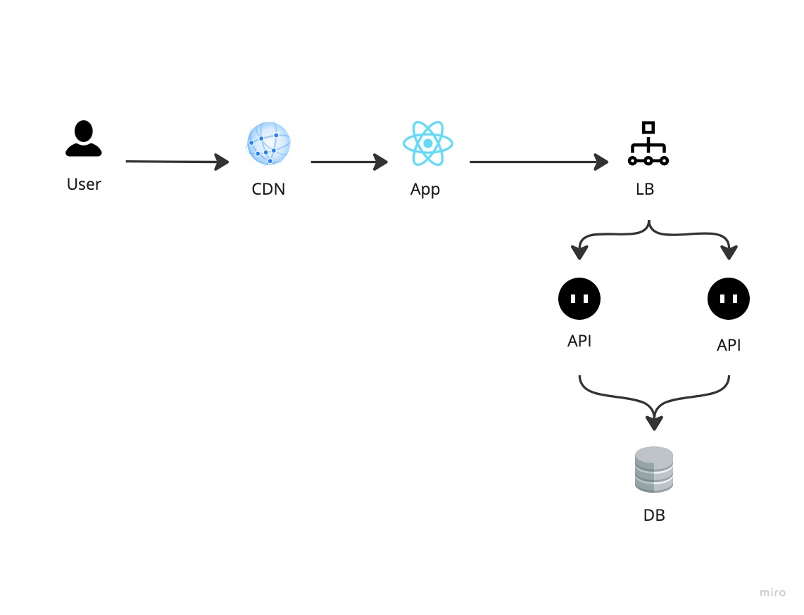

## Web Two Factor Authentication

This is a sample project to demonstrate how to implement a two-factor authentication system using web technologies.

### How to run?

1. Make sure you have the latest version of Docker with Docker Compose installed on your machine.
2. Clone the repository.
3. Run `docker-compose up` in the root directory of the project.
4. Make sure the app and API are running.
5. Open `http://localhost:5173` in your browser.

This will start a development server.

### High-level overview

- There are 4 main pages in the app
  - Home - Simple page with a button to go to the dashboard.
  - Login - Login form with email and password.
  - Register - Sign up page with name, email password.
  - Dashboard - the main page of the app. this page is protected and can only be accessed by authenticated users.
- This app uses JWT for authentication and Webauthn for two-factor authentication.
- When a user goes into the dashboard, if the user is not authenticated, will be redirected to the login page.
- If the user is not registered, She can go to the register page and create an account.
- After the user is registered, she will be redirected to the login page.
- If the user has already registered a two factor authentication method, she will have to login using the configured method as the second step (after the email and password).
- After the user is logged in, User will be redirected to the Two Factor Authentication page if a  two factor authentication method is not configured. The user can skip this step if she wants.
- Once the user is logged in, she can disable or enable the two factor authentication method from the dashboard page.
- The user can also logout from the dashboard page.

### High-level architecture

### App notes

- The app (`web` folder) is a single page application bulit using React.
- Uses fetch to connect to the API.
  - React Router for routing.
  - Tailwind CSS for styling.
  - Vite for bundling.
- The app is broken down to 4 main features
  - `auth` - handles authentication and authorization (Login, Register, 2-factor).
  - `dashboard` - handles the dashboard page.
  - `home` - Home page.
  - `shared` - shared components and utilities.

### API notes

- The API (`api` folder) is a a Node.JS application.
- Uses Express to create the API.
  - Dotenv for configuration.
  - Vite for bundling.
  - Jest for testing.
  - Prisma to access the database.
  - Inversify for dependency injection.
- The API is broken down to 3 main features
  - `auth` - handles authentication and authorization (Login, Register, 2-factor).
  - `helpers` - contans helper classes.
  - `shared` - shared base classes and interfaces.

### API Endpoints

- `POST /api/v1/users` - Sign up a new user.
- `GET /api/v1/users/me` - Get the currently logged in user.
- `POST /api/v1/auth` - Sign in.
- `GET /api/v1/auth/two-factor-auth/options` - Get options for TFA registration.
- `POST /api/v1/auth/two-factor-auth/verify` - Verify the TFA registration.
- `DELETE /api/v1/auth/two-factor-auth` - De-Register the TFA.

### Webauthen

This app ueses Webauthn for two-factor authentication. Implemented with the help of 
[SimpleWebAuthn](https://simplewebauthn.dev/)

### CI/CD

- The app and the API will be tested and linted for every push using Github Actions.
- The workflow is defined in the `.github/workflows` folder.
